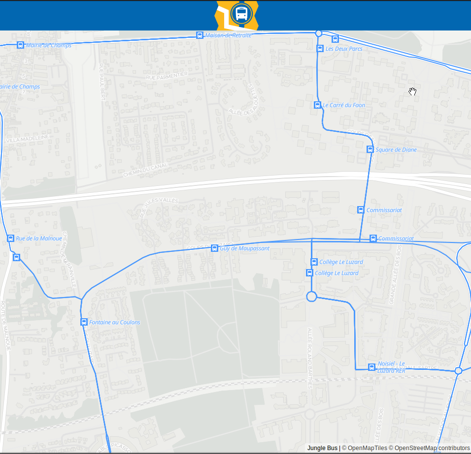
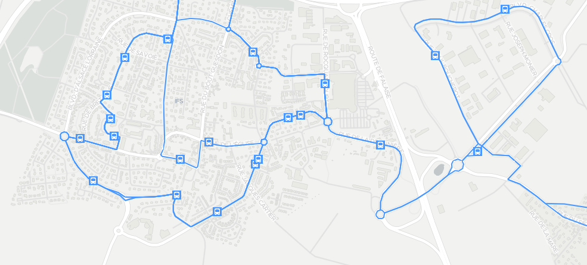
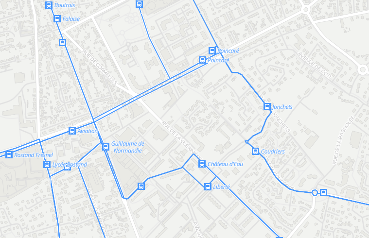
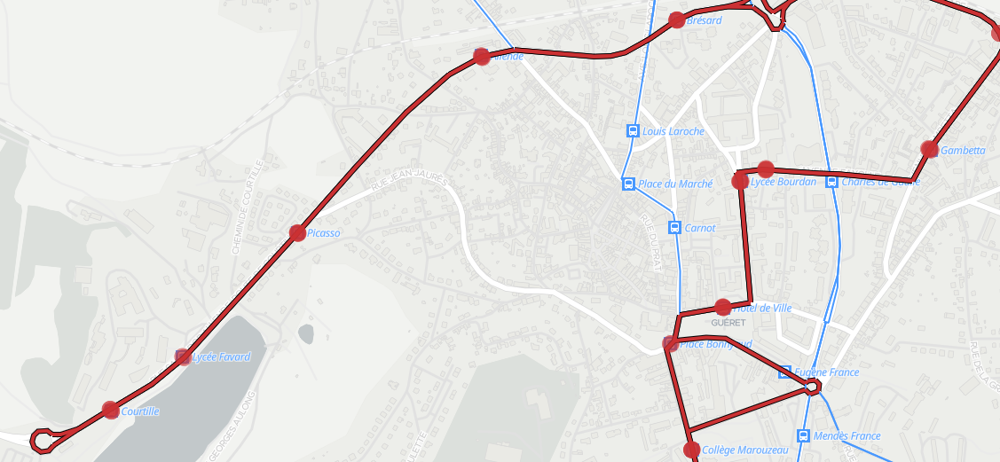

# VapourTrail
VapourTrail is a vector tile schema for OpenStreetMap bus data.

It allows to create interactive map with buses without using Overpass API (because Overpass is great but we need to learn to stop relying on it).

## Use cases

Show bus stops

Show roads where buses go

Show properties of a bus stop (shelter, etc)

Show bus routes serving a bus stop

Show all tracks and stops for a selected bus route

Show properties and list of stops for a selected bus route

Show all routes for a bus line

## Schema

:construction::warning: This is a work in progress, the schema is not stable yet :warning::construction:

## Contribute
### Dependencies
* imposm3
* t-rex
* docker / docker-compose

### How to run
Put an .osm.pbf file into docker/imposm/import directory.

Run `docker-compose up -d` to run the services in detached mode.

The first run will perform several actions:

* download all the required base images,
* build and run the containers
* create the database
* import the osm.pbf file in the `docker/imposm/import/` directory
* execute the post_process SQL file

The tiles rendered by t-rex are available at `http://localhost:6767/`.

The web front-end is available at `http://localhost:8082/vapour_trail.html`.

**Troubleshooting**: If you don't see the name of the bus stops on the map or if the bus stop popups are empty, try to restart t-rex service: `docker-compose restart t-rex`

## License

This project has been developed by the [Jungle Bus](http://junglebus.io/) team, a French non-profit organization dedicated to bus public transport in OpenStreetMap. Please reuse!

The code in this repository is under the MIT license.

This project relies on OpenStreetMap data so you need to credit the contributors. We propose the following wording:
    [Jungle Bus](http://junglebus.io/) [© OpenStreetMap contributors](http://www.openstreetmap.org/copyright)

If you value this work, show your support by donating to the [OSM French local chapter](http://openstreetmap.fr).

## Name
    🎼 There's a monkey in the jungle watching a vapour trail 🎶

    🎵 Caught up in the conflict between his brain and his tail 🎜
